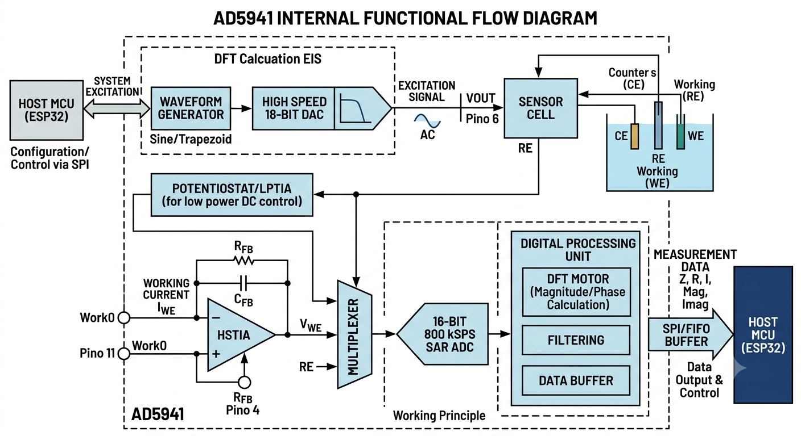

Baseado nas especificações oficiais e nos manuais de aplicação do datasheet do **AD5941**, apresento a descrição técnica estruturada para o seu relatório de engenharia:

---

### 1. Descrição do Funcionamento

O AD5941 é um Front-End Analógico (AFE) de alta precisão projetado como um sistema de medição eletroquímica e de impedância integrado. 
O fluxo de funcionamento do **AD5941** opera como um ciclo fechado de instrumentação controlada. Ele transforma comandos digitais em sinais analógicos de excitação, injeta esses sinais na célula do sensor, coleta a resposta em corrente e a processa digitalmente por hardware para devolver os dados de impedância mastigados para o ESP32.

O caminho exato que o sinal percorre divide-se em **4 estágios principais**:

### 1. Comando do Host e Geração do Sinal (Excitação)

Todo o ciclo começa no microcontrolador Host (**ESP32**), que envia as configurações de ensaio via barramento **SPI** (frequência inicial, frequência final, número de passos e amplitude).

* **O Sequencer:** O interpretador de comandos interno do AD5941 (*Sequencer*) assume o controle automático do chip para liberar o processamento do ESP32.
* **Gerador de Formas de Onda:** O bloco digital gera os pontos matemáticos de uma senoide (para Espectroscopia de Impedância - EIS) ou de uma rampa/degrau (para Voltametria/Amperometria).
* **High-Speed DAC (16 bits):** Converte esses pontos digitais em um sinal analógico real e passa por um filtro reconstrutor para eliminar harmônicos e ruídos de chaveamento, gerando uma onda AC limpa no pino **`VOUT` (Pino 6)**.

### 2. Interação com a Célula Sensora

O sinal de excitação analógico sai do chip e atua diretamente sobre o seu sensor ou eletrodo:

* Em uma configuração clássica de 3 fios, o **Contra-Eletrodo (CE)** injeta a corrente necessária na solução para que o **Eletrodo de Referência (RE)** mantenha exatamente o potencial de corrente contínua (DC) configurado.
* O sinal elétrico resultante da reação química ou bioelétrica atravessa o meio e é coletado pelo **Eletrodo de Trabalho (WE)**, gerando uma corrente proporcional à impedância do sistema.

### 3. Condicionamento Analógico (Conversão $I \rightarrow V$)

A corrente gerada pela célula entra de volta no AD5941 pelo pino **`WE0` (Pino 11)**. Como sinais de corrente na ordem de nanoampères são extremamente difíceis de digitalizar diretamente, eles precisam ser condicionados:

* **Amplificador de Transimpedância (HSTIA):** O amplificador operacional de alta velocidade recebe essa corrente e, usando o resistor de ganho programável ($R_{FB}$), converte essa corrente analógica em um sinal de tensão correspondente ($V_{WE}$).
* **Multiplexador (MUX):** O chaveador interno direciona as tensões vindas do HSTIA (sinal de corrente convertido) ou dos canais de calibração (como o pino do resistor **$R_{CAL}$**) direto para a entrada do conversor analógico-digital.

### 4. Digitalização e Motor Matemático (DFT)

Esta é a etapa onde o AD5941 poupa o trabalho pesado de cálculo do ESP32:

* **SAR ADC de 16 bits:** O conversor digitaliza as formas de onda analógicas de tensão a uma taxa de amostragem de até **800 kSPS**.
* **Motor de DFT por Hardware:** Os dados brutos do ADC entram direto no bloco de processamento digital, que calcula em tempo real a **Transformada Discreta de Fourier (DFT)**. Ele extrai de forma puramente matemática a magnitude e a fase da onda, isolando o ruído.
* **FIFO e Interrupção (IRQ):** O chip calcula e separa os componentes **Reais (R)** e **Imaginários (I)** da impedância complexa e joga os resultados finais em uma memória buffer FIFO de 6 kB. Assim que o buffer atinge o limite configurado, o AD5941 joga o pino **`IRQ` (Pino 25)** para nível lógico baixo, avisando o ESP32: *"Os dados de impedância estão prontos, pode vir buscá-los via SPI"*.

---

### Resumo Visual do Caminho do Sinal:

$$\text{ESP32 (SPI)} \rightarrow \text{Gerador de Onda} \rightarrow \text{DAC} \rightarrow \text{Sensor (Célula)} \rightarrow \text{HSTIA (I}\rightarrow\text{V)} \rightarrow \text{ADC (16-bit)} \rightarrow \text{Motor DFT} \rightarrow \text{FIFO} \rightarrow \text{ESP32}$$

---

### 2. Objetivo do Componente no Projeto

No contexto do desenvolvimento de sensores de instrumentação avançada, o objetivo do AD5941 é **centralizar, blindar e miniaturizar toda a instrumentação analógica complexa** que antes exigiria dezenas de amplificadores operacionais discretos.
Ele visa fornecer medições repetíveis de:

* **Espectroscopia de Impedância Bioelétrica (EIS):** Caracterização de tecidos biológicos, sensores interdigitais e varreduras de frequência de soluções.
* **Sensores Eletroquímicos Amperométricos e Voltagramas:** Leituras de sensores de gases, glicose ou análises de corrosão a 2, 3 ou 4 fios.

---

### 3. Modos de Operação

O chip pode ser alternado dinamicamente entre diferentes modos de operação de acordo com a necessidade do ensaio:

* **Modo EIS (Electrochemical Impedance Spectroscopy):** O gerador de onda injeta uma varredura senoidal AC (geralmente entre 10 Hz e 200 kHz) sobreposta a uma tensão DC de polarização, medindo a variação da impedância complexa em função da frequência.
* **Modo Potenciostato de Baixa Potência (Loop de 3 fios):** Ativa o amplificador de baixa potência (LPAmp) e o LPTIA para manter o potencial estável entre os eletrodos de Referência (RE) e Contra-Eletrodo (CE), medindo correntes contínuas estáveis ou lentas (Amperometria).
* **Modo Hibernação / Ciclo de Trabalho (Duty-Cycled):** O temporizador interno (Sequencer) acorda o chip periodicamente, realiza a medição analógica, armazena na FIFO, gera uma interrupção (IRQ) para o ESP32 e coloca o AFE de volta em modo de ultra-baixo consumo.

---

### 4. Parâmetros Utilizados (Configurações Críticas)

Para realizar as medições com exatidão, os seguintes parâmetros internos e externos devem ser configurados no firmware:

* **Frequência de Excitação:** Ajustada via registradores para varrer faixas específicas do sensor (ex: 10 kHz a 100 kHz).
* **Ganho do TIA ($R_{TIA}$):** Resistor interno programável de ganho (valores de $200\,\Omega$ a $512\,\text{k}\Omega$) selecionado para casar com a ordem de grandeza da impedância medida e evitar a saturação do ADC.
* **Resistor de Calibração ($R_{CAL}$):** Parâmetro de hardware externo (tipicamente $1\,\text{k}\Omega$, 0.1%) usado como métrica imutável para o cálculo do fator de ganho elétrico do sistema.
* **Configuração da DFT:** Número de pontos de amostragem da DFT (ex: 16, 64, ou 1048 pontos) para equilibrar a relação sinal-ruído (SNR) e o tempo de resposta da medição.

---

### 5. Principais Limitações Observadas no Uso do Componente

Apesar de sua altíssima precisão, o AD5941 apresenta limitações severas de projeto que o engenheiro de hardware deve mitigar:

* **Limite de Frequência Superior:** A resposta de frequência útil para medições de impedância com erro controlado é limitada a **200 kHz**. Acima disso, os desvios de fase introduzidos pelos amplificadores internos degradam consideravelmente a precisão.
* **Complexidade de Configuração do Firmware:** O chip não é "Plug-and-Play". Ele opera baseado em um interpretador de comandos interno (*Sequencer*). O desenvolvimento do código em C exige uma curva de aprendizado íngreme sobre a biblioteca *AD5940_Main* da Analog Devices para estruturar as sequências de registradores corretamente.
* **Sensibilidade Extrema ao Ruído de Layout:** Por integrar sinais digitais de SPI com correntes analógicas na ordem de nanoampères, qualquer erro no desenho das pistas da PCB (como falta de plano de terra isolado ou capacitância parasita nas linhas do cristal) resulta em distorções e ruídos intermitentes nas leituras de fase.
* **Encapsulamento Restritivo para Soldagem:** A versão padrão industrial (WLCSP) utiliza esferas sob o chip extremamente difíceis de alinhar. Mesmo a versão selecionada para o projeto (**LFCSP-48**), embora possua terminais expostos nas laterais, exige stencil profissional ou estações de ar quente de alta precisão com fluxo adequado para evitar pontes de solda sob o *thermal pad* centralizado de GND.
