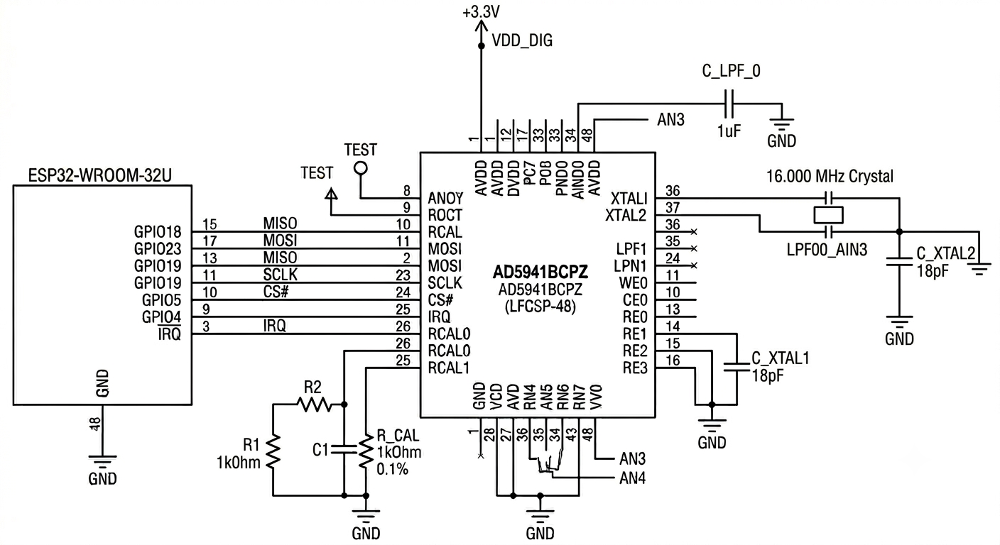

# 1. FUNÇÕES DOS COMPONENTES NO CIRCUITO

## A. Núcleos de Processamento e Condicionamento

* **AD5941BCPZ (AFE):** Atua como o Front-End Analógico (AFE) de alta precisão e coração analógico do sistema. Integra internamente geradores de forma de onda, conversores digital-analógico (DAC) de 16 bits, amplificadores operacionais de transimpedância de alta velocidade (HSTIA), conversores analógico-digital (SAR ADC) e um motor matemático dedicado para execução da Transformada Discreta de Fourier (DFT). Sua função primária envolve excitar a amostra com sinais senoidais programáveis e extrair as componentes vetoriais complexas Real ($R$) e Imaginária ($I$) da impedância sob ensaio.
* **ESP32-WROOM-32E:** Atua como o host microcontrolador central do sistema. É responsável por inicializar e configurar os registradores de controle do AD5941 através do barramento periférico SPI, gerenciar os parâmetros e disparos de medição, realizar a varredura de frequências, ler os vetores complexos armazenados na memória FIFO por meio de rotinas de interrupção externa de alta velocidade e realizar o pós-processamento analítico, armazenamento local ou transmissão de dados.

## B. Sistema de Clock Externo

* **Cristal de 16 MHz (ECS Inc.):** Provede a referência master de clock estável necessária para a temporização interna do AD5941. Sem essa precisão externa de clock, o motor matemático de hardware da DFT sofreria desvios analógicos acumulados de fase e frequência (*drift*), invalidando a precisão dos cálculos de impedância.
* **Capacitores de Carga de 12 pF (TDK):** Conectados em paralelo com os terminais do cristal em direção à referência de terra (GND). Eles garantem que o ressonador enxergue sua capacitância de carga nominal ideal de fábrica ($C_L = 9\text{ pF}$), balanceando de maneira exata as capacitâncias parasitas introduzidas pelas trilhas físicas e pads da placa de circuito impresso ($C_{stray} \approx 3\text{ pF}$), conforme rege a equação de equilíbrio de malhas:

$$C_L = \frac{C_1 \cdot C_2}{C_1 + C_2} + C_{stray} = \frac{12 \cdot 12}{12 + 12} + 3 = 6 + 3 = 9\text{ pF}$$

O uso do dielétrico do tipo C0G (NP0) é obrigatório devido ao seu coeficiente térmico nulo, o que impede variações de frequência provocadas por flutuações de temperatura ambiente na bancada de ensaio.

## C. Rede de Filtragem e Desacoplamento (Bypass)

* **Capacitor de 10 $\mu$F (Encapsulamento 1206):** Capacitor do tipo *Bulk* posicionado na entrada principal da malha de alimentação de 3.3V CC. Funciona como um acumulador de carga local, atenuando ruídos de baixa frequência e absorvendo quedas transitórias de tensão na linha causadas pelas demandas abruptas de corrente vindas do rádio Wi-Fi e Bluetooth do módulo ESP32.
* **Capacitores de 0.1 $\mu$F (Encapsulamento 0603):** Componentes de desacoplamento (*bypass*) soldados o mais próximo possível (distância física estrita inferior a 1.5 mm) de cada pino de alimentação analógica e digital do AD5941. Eles eliminam espasmos e ruídos parasitas de alta frequência na faixa de megahertz (MHz) injetados pelo chaveamento lógico digital, blindando o estágio de entrada do ADC.
* **Capacitor de 1 $\mu$F (Encapsulamento 0603):** Conectado diretamente ao pino regulador `Reg_DVDD` para estabilização interna da malha do regulador linear LDO integrado do AD5941, prevenindo o surgimento de oscilações indesejadas no silício do circuito digital.